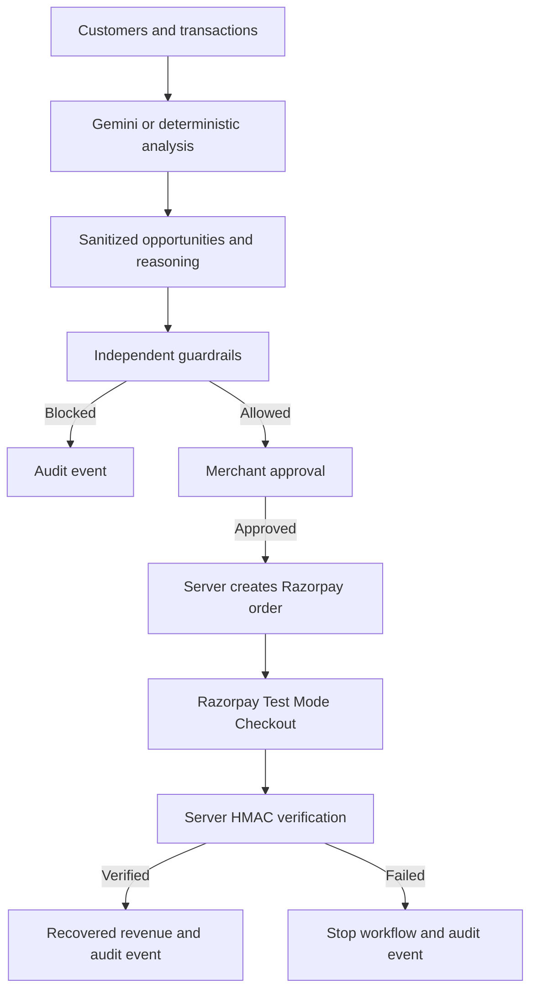

# MerchantMind: Controlled AI Commerce Recovery Agent

> AI recommends. Guardrails constrain. The merchant decides.

🔗 **[Live Demo](https://merchantmind-gnjj.vercel.app/)**

MerchantMind is an explainable revenue-recovery dashboard built for the **Razorpay AI Buildathon, Track 01: AI Growth & Agentic Commerce**. It finds high-intent abandoned carts and failed payments, explains each recommendation, validates the recommendation against financial policy, and requires merchant approval before any payment action.

## What I Built

### Revenue intelligence

- Added a realistic dataset of **300 customers and 1,000 transactions**.
- Classifies customers into VIP, high-value, returning, new, at-risk, and inactive segments.
- Tracks product categories, customer lifetime value, previous purchases, average order value, activity recency, cart value, and payment-failure reasons.
- Calculates Revenue at Risk, AI Targeted Opportunity, Projected Recovery, Verified Recovered Revenue, and Recovery Rate from the source data.
- Shows dataset coverage and transaction-status breakdowns before analysis is run.

### AI analysis with a reliable fallback

- Added a provider abstraction for Gemini-backed analysis.
- Added a deterministic rule-based engine so the dashboard still works without AI credentials.
- Selects opportunities from abandoned carts above the high-value threshold and payment failures.
- Uses customer history, cart value, lifetime value, segment, recency, and failure reason to calculate confidence and priority.
- Enforces the lowest-cost action strategy: payment reminders and retry suggestions are preferred before discounts.
- Sanitizes model output against real customer and transaction IDs, re-derives money values, clamps discounts, and rejects hallucinated records.
- Displays structured explanations for **Why This Customer**, **Why This Action**, and **Why This Amount**.

### Analytics dashboard

- Added customer-segment analytics and segment-level opportunity summaries.
- Added product-category and transaction-status visualizations.
- Added priority, confidence, risk, recovery, and discount views for surfaced opportunities.
- Added an agent decision-flow view showing Observe, Analyze, Guard, Approve, Execute, Verify, and Audit stages.
- Added demo-mode state and scenario controls for repeatable presentations.

### Guardrails and human approval

The independent guardrail engine validates every opportunity before payment:

- Minimum AI confidence: 70%.
- Maximum discount: 5% of cart value.
- Maximum individual discount: ₹500.
- Maximum approved session incentive budget: ₹5,000.
- Customer and transaction IDs must exist in the trusted dataset.
- Action types must be policy-approved.
- Merchant approval is required before order creation.

Blocked, rejected, approved, processing, successful, and failed states are visible per opportunity. A failed payment stops the workflow and does not automatically retry.

### Razorpay payment flow

1. The browser sends only the trusted `opportunityId` to the server.
2. The server looks up the opportunity and recalculates the final amount.
3. The server re-runs guardrails and creates a Razorpay Test Mode order.
4. Razorpay Checkout handles the payment.
5. The server verifies the `sha256` HMAC signature using `RAZORPAY_KEY_SECRET`.
6. Verified recovered revenue is updated only after signature and server-side amount checks pass.

Client-provided amounts are never trusted, and the Razorpay secret never reaches the browser.

### Audit and failure transparency

- Added an append-only audit ledger persisted in browser local storage for the demo.
- Records analysis, opportunity identification, guardrail checks, approvals, rejections, order creation, payment results, and stopped workflows.
- Tags events with `AI_AGENT`, `SYSTEM`, `MERCHANT`, or `RAZORPAY` actors.
- Includes a clear simulated AI-unavailable path and failed-payment scenario for demonstrating graceful degradation.

## Recent Updates

**September 2026** — Dependency Updates & Next.js 16 Upgrade
- ✅ Updated to **Next.js 16.3.4** (from 15.5.25) with Turbopack compilation
- ✅ Updated **TypeScript 5.7.2** with enhanced type safety
- ✅ Updated **Tailwind CSS 3.4.17** for latest styling features
- ✅ Updated **ESLint 9.17.0** with improved linting rules
- ✅ Verified **production build** passes all type checks and compiles cleanly
- ✅ Confirmed **payment API security** unchanged: HMAC verification and server-side amount validation intact
- ✅ All environment variables (`GEMINI_API_KEY`, `RAZORPAY_KEY_ID`, `RAZORPAY_KEY_SECRET`, `NEXT_PUBLIC_RAZORPAY_KEY_ID`) properly referenced
- ✅ **Zero breaking changes** — all existing functionality preserved

## Architecture



## Project Structure

```text
app/
    api/analyze/                    AI and deterministic analysis endpoint
    api/payment/create-order/       Trusted Razorpay order creation
    api/payment-status/             HMAC payment verification
    dashboard/                      Main dashboard route
components/dashboard/
    AgentDecisionFlow.tsx           Agent lifecycle visualization
    AgentAnalysis.tsx               Analysis controls and results
    AnalyticsVisualizations.tsx     Revenue and transaction charts
    CustomerSegmentAnalytics.tsx    Customer segment intelligence
    DatasetOverview.tsx             Dataset coverage and status metrics
    GuardrailPanel.tsx              Policy check results
    ApprovalPanel.tsx               Merchant approval controls
    PaymentModal.tsx                Razorpay checkout integration
    AuditTrail.tsx                  Append-only event history
lib/
    ai.ts                           Provider, fallback, sanitization, recommendations
    calculations.ts                 Metrics, priority scores, INR formatting
    guardrails.ts                   Independent financial policy engine
    audit.ts                        Local audit ledger
    razorpay.ts                     Server-only Razorpay client
    types.ts                        Shared domain and API contracts
data/
    customers.json                  300 customer records
    transactions.json               1,000 transaction records
```

## Run Locally

Install dependencies:

```bash
npm install
```

Copy the safe template and add your own local credentials:

```powershell
Copy-Item .env.example .env.local
```

Then edit `.env.local`:

```env
GEMINI_API_KEY=your_gemini_api_key
RAZORPAY_KEY_ID=your_razorpay_key_id
RAZORPAY_KEY_SECRET=your_razorpay_key_secret
NEXT_PUBLIC_RAZORPAY_KEY_ID=your_razorpay_key_id
```

Start the development server:

```bash
npm run dev
```

Open [http://localhost:3000/dashboard](http://localhost:3000/dashboard).

The deterministic fallback works without `GEMINI_API_KEY`. Razorpay order creation requires valid Razorpay Test Mode credentials.

## API Endpoints

| Method | Route | Purpose |
| --- | --- | --- |
| `POST` | `/api/analyze` | Runs Gemini analysis or deterministic fallback. Use `{ "forceFallback": true }` for a predictable demo. |
| `POST` | `/api/payment/create-order` | Validates `{ "opportunityId": "..." }` and creates a server-calculated Razorpay order. |
| `POST` | `/api/payment-status` | Verifies Razorpay order ID, payment ID, signature, and trusted amount. |

## Verification

Run the production checks before deployment:

```bash
npx tsc --noEmit
npm run build
```

The production build currently compiles, passes lint/type validation, and generates all app routes successfully.

## Demo Flow

1. Open the dashboard and review Revenue at Risk and dataset coverage.
2. Choose a demo scenario and run analysis.
3. Expand an opportunity to inspect recommendation factors and reasoning.
4. Open the guardrail review and inspect each policy check.
5. Approve or reject the action as the merchant.
6. In a configured Razorpay Test Mode environment, complete Checkout and inspect server verification.
7. Review the audit trail and verified revenue.
8. Run the AI failure and failed-payment scenarios to show fallback behavior and workflow stopping.

## Secret Handling

Real API keys are intentionally **not committed to Git**. `.env.example` contains placeholders only, and `.env.local` is ignored by Git. Configure secrets locally or in the deployment provider's environment settings. If a real key was ever exposed publicly, revoke and rotate it immediately.
