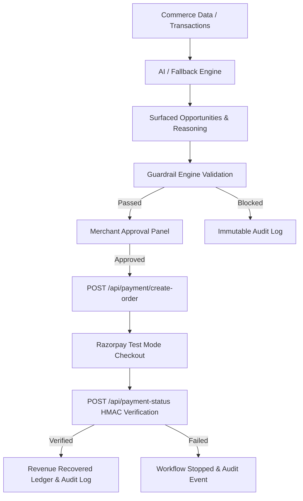

# MerchantMind — Controlled AI Commerce Recovery Agent

> **"AI recommends. Guardrails constrain. The merchant decides."**

Built for **Razorpay AI Buildathon — Track 01: AI Growth & Agentic Commerce**.

MerchantMind is a production-hardened, explainable AI commerce agent that identifies revenue recovery opportunities, explains its reasoning across multi-dimensional customer signals, enforces strict financial guardrails, requires explicit merchant approval, executes through server-verified Razorpay Test Mode orders, and maintains an immutable audit ledger.

---

## 🏆 Product Positioning & Core Principles

MerchantMind is **NOT** a raw chatbot connected to a payment button. It is a controlled AI commerce agent built around eight core pillars:

1. **OBSERVE** — Continuous analysis of abandoned carts and failed payment signals.
2. **ANALYZE & REASON** — Plain-language reasoning explaining *Why This Customer?*, *Why This Action?*, and *Why This Amount?*.
3. **LOWEST-COST ACTION STRATEGY** — Prefers zero-cost actions (Payment Reminders, Payment Retry Suggestions) before offering discounts.
4. **GUARD** — Bounded financial execution enforced by an independent Guardrail Engine (5% cart cap, ₹500 discount ceiling, ₹5,000 budget cap).
5. **APPROVE** — Strict human-in-the-loop sign-off required before any money-moving operation can reach Razorpay.
6. **EXECUTE** — Server-side calculation of amounts (`opportunityId` payload only; client amounts are never trusted).
7. **VERIFY** — Server-side HMAC signature and amount verification via Razorpay Test Mode.
8. **AUDIT & REVENUE TRANSPARENCY** — Immutable append-only ledger tracking all actions with actor tags (`AI_AGENT`, `SYSTEM`, `MERCHANT`, `RAZORPAY`).

---

## 🏗️ Technical Architecture



---

## 🔒 Security Architecture & Payment Guardrails

### 1. Server-Side Financial Source of Truth
- **Client payload:** Client sends **only** `opportunityId`.
- **Server calculation:** The server fetches the trusted transaction and customer, recalculates cart value, calculates discount, verifies guardrails, and sets the order amount. Client-supplied amounts are ignored.

### 2. Multi-Layer Guardrail Engine
- **Confidence Threshold:** $\ge 70\%$ AI confidence required.
- **Max Discount %:** $\le 5\%$ of cart value.
- **Max Discount Amount:** $\le ₹500$ INR ceiling.
- **Campaign Budget:** Running session cap of $\le ₹5,000$ total incentive.
- **Valid Opportunity & Customer:** Cross-referenced against dataset IDs.
- **Valid Action Type:** Policy-checked action type (`discount`, `payment_reminder`, `payment_retry_suggestion`).
- **Merchant Approval:** Mandatory sign-off flag.

### 3. Payment Verification
- Server calculates `sha256` HMAC signature using `RAZORPAY_KEY_SECRET`.
- Verification compares signature, order ID, payment ID, and matches the paid amount against server-calculated recovery value.

---

## 📊 Revenue Impact & Measurement Metrics

The dashboard calculates transparent metrics with zero artificial rate assumptions:

- **Revenue At Risk:** Total cart value of abandoned carts and failed payments ($\sum \text{Cart Value}$).
- **AI Targeted Opportunity:** Total value of AI-surfaced recovery opportunities.
- **Projected Recovery:** Net estimated recovery ($\sum (\text{Cart Value} - \text{Incentive})$), labeled as a model estimate.
- **Revenue Recovered:** Verified paid revenue (ONLY increases after successful server-side Razorpay signature & amount verification).
- **Recovery Rate:** $(\text{Revenue Recovered} / \text{Revenue At Risk}) \times 100$.

---

## 🚀 Environment Setup & Vercel Deployment

### Required Environment Variables
Create a `.env.local` file (never committed to Git):

```env
GEMINI_API_KEY=your_gemini_api_key_here
RAZORPAY_KEY_ID=your_razorpay_key_id
RAZORPAY_KEY_SECRET=your_razorpay_key_secret
NEXT_PUBLIC_RAZORPAY_KEY_ID=your_razorpay_key_id
```

### Local Setup
```bash
npm install
npm run dev
```

### Production Build & Lint Checks
```bash
npx tsc --noEmit
npm run lint
npm run build
```

---

## 🎥 5-Minute Technical Interview & Demo Flow

1. **Dashboard Overview:** View *Revenue At Risk*, *AI Targeted Opportunity*, and the *Controlled Agent Workflow*.
2. **Run AI Analysis:** Trigger recovery analysis via Gemini API or automatic deterministic fallback.
3. **Inspect Reasoning:** Expand top opportunity card to see structured *Why Customer*, *Why Action*, *Why Amount*, and *Estimated Net Revenue*.
4. **Guardrail Engine Check:** Review all 8 automated financial guardrails passing.
5. **Merchant Approval:** Click *Approve Action* and confirm sign-off.
6. **Razorpay Checkout:** Open test checkout and complete payment.
7. **Server-Side Verification:** Server verifies HMAC signature and updates *Verified Recovered Revenue* and the *Immutable Audit Trail*.
8. **Graceful Failure UX:** Test *Failed Payment* scenario to verify workflow stops safely without auto-retry.
